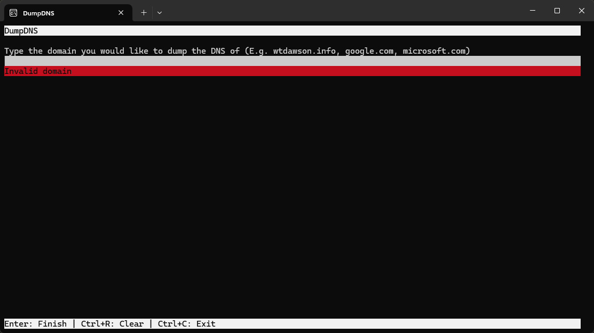
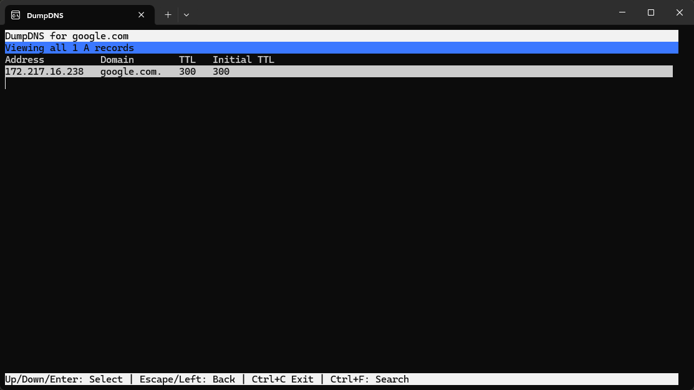

# DumpDNS

Easily view the DNS records of a domain.

Download, install, and then run `DumpDNS` in the command prompt to get started.

## About
This is probably one of my more complex projects, as it displays everything in the console without any library to help.
It uses `DNSClient.NET` for the actual fetching of the DNS records, but everything else is written by me.

## How to use
Once installed, you can launch it anywhere on your computer by searching for `DumpDNS` in the start menu, typing `DumpDNS` in cmd/powershell, or Pressing Win+R and typing `DumpDNS` and starting it.

1. Type in the domain that you would like to dump the DNS records of, then press enter. (It may take a few seconds to fetch DNS records).
2. Navigate through the menus to look at the various DNS record types, and if you want to see really long records (TXT records for instance), press `Shift+Enter` to enter fullscreen (Same command again to exit).
3. Press `Ctrl+D` to dump the DNS records to a file.
4. Use `Escape`, or `Left Arrow` to go back through menus.

## Screenshots

