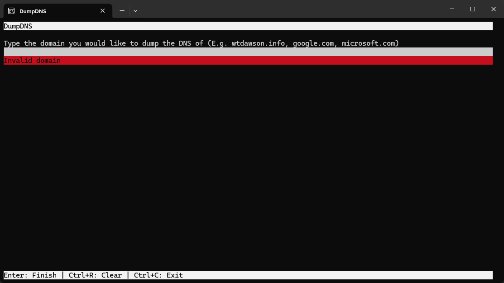
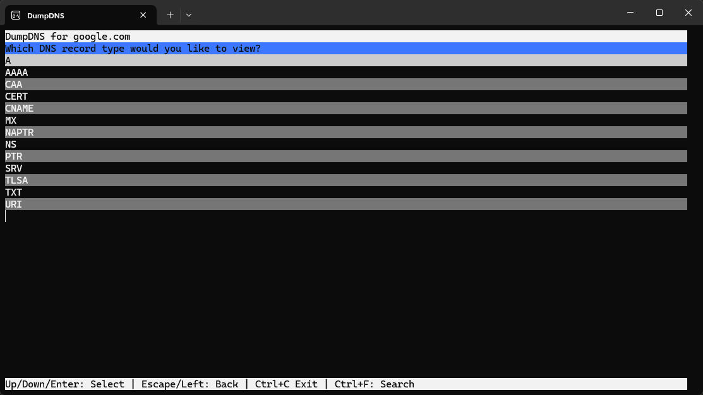
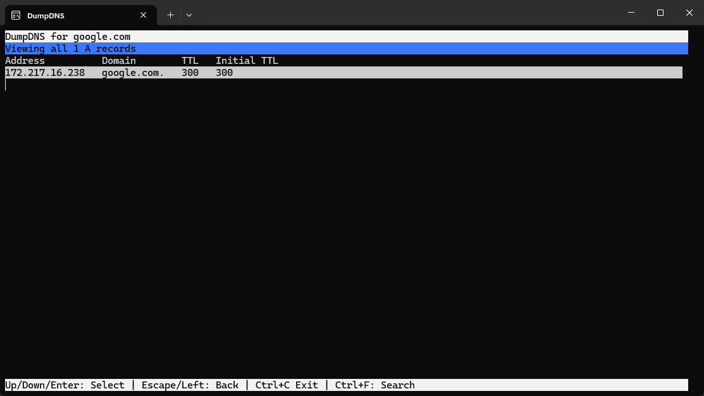

# DumpDNS

Easily view the DNS records of a domain.

Download, install, and then run `DumpDNS` in the command prompt to get started.

## About

This is probably one of my more complex projects, as it displays everything in the console without any library to help.
It uses `DNSClient.NET` for the actual fetching of the DNS records, but everything else is written by me.

## How to use

### TUI

Once installed, you can launch it anywhere on your computer by searching for `DumpDNS` in the start menu, typing `DumpDNS` in cmd/powershell, or Pressing Win+R and typing `DumpDNS` and starting it.

1. Type in the domain that you would like to dump the DNS records of, then press enter. (It may take a few seconds to fetch DNS records).
2. Navigate through the menus to look at the various DNS record types, and if you want to see really long records (TXT records for instance), press `Shift+Enter` to enter fullscreen (Same command again to exit).
3. Press `Ctrl+D` to dump the DNS records to a file.
4. Use `Escape`, or `Left Arrow` to go back through menus.

### CLI

The CLI was introduced in DumpDNS 3.0.0, and provides a way of getting the same information,
but without having to navigate through a TUI.

Once installed, you can use `DumpDNS -?` or `DumpDNS /?` to get the usage information,
which is also available below.

Usage: `DumpDNS <Domain> [options]`

**Note:** Dash (`-`) and and double dash (`--`) can be replaced with a forward slash (`/`)
to follow the windows syntax.

| Option                | Usage                                |
| --------------------- | ------------------------------------ |
| [Dump](#dump)         | `-d, --dump <path>`                  |
| [DNS](#dns)           | `--dns <ip>`                         |
| [DNS Port](#dns-port) | `-dp, --dns-port, --port <port>`     |
| [Records](#records)   | `-r, --records <record type>`        |
| Statistics            | `-s, --statistics, --stats`          |
| Colour                | `-c, --color, --colour`              |
| Depth*                | `-dt, --depth <Full\|Medium\|Minimal>` |

\* - Not yet fully implemented/Experimental

#### Dump

**Usage:** `-d, --dump <path>` 
**Description:** If provided, DumpDNS will dump the results to the file path specified instead of the console.

#### DNS

**Usage:** `--dns <ip>` 
**Description:** Specifies the IP address of the DNS server to use instead of the default DNS server on the current computer.

#### DNS Port

**Usage:** `-dp, --dns-port, --port <port>` 
**Description:** Specifies the port of the DNS server, this is only useful when used when specifying a custom DNS server. 
**Default:** 53 
**Note:** Only works when specifying [DNS](#dns) too.

#### Records

**Usage:** `-r, --records <record type>` 
**Description:** Specifies the records to use (you can specify more than one).  
**Options:** A, AAAA, CAA, CERT, CNAME, MX, NAPTR, NS, PTR, SRV, TLSA, TXT, URI 
**Default:** All

## Screenshots

